<picture>
  <source media="(prefers-color-scheme: dark)" srcset="./dark.svg">
  
</picture>

### Hi there 👋

<b>🌱 CSS Projects</b>

  <ul>
    <li><a href="https://github.com/DmitryKolotilshikov/simple-tabs">Simple tabs</a></li>
    <li><a href="https://github.com/DmitryKolotilshikov/3d_cards">3D Cards (flip cards)</a></li>
  </ul>

<b>⚡ JS Projects</b>
  
  <ul>
    <li><a href="https://github.com/DmitryKolotilshikov/full_js_course">FULL JavaScript Course | Большой курс по JavaScript</a></li>
    <li><a href="https://github.com/DmitryKolotilshikov/todo-app-simple-ver1">TODO App (super simple)</a></li>
    <li><a href="https://github.com/DmitryKolotilshikov/todo-app-func">TODO App (advanced) | variant 1</a></li>
    <li><a href="https://github.com/DmitryKolotilshikov/todo-app-advanced-ver2">TODO App (advanced) | variant 2</a></li>
    <li><a href="https://github.com/DmitryKolotilshikov/todo-application-mvc">TODO application MVC (Model View Controller)</a></li>
    <li><a href="https://github.com/DmitryKolotilshikov/todo-app-oop">TODO App (OOP style)</a></li>
    <li><a href="https://github.com/DmitryKolotilshikov/calendar">Calendar App (advanced) | Календарь</a></li>
    <li><a href="https://github.com/DmitryKolotilshikov/trello-desks-todo-app">Trello TODO App (OOP style)</a></li>
    <li><a href="https://github.com/DmitryKolotilshikov/img_parse">Image uploading and previewing</a></li>
    <li><a href="https://github.com/DmitryKolotilshikov/dice_game">Dice game App | Игра в кости</a></li>
    <li><a href="https://github.com/DmitryKolotilshikov/simple-image-slider">Image Slider | Адаптивный слайдер</a></li>
    <li><a href="https://github.com/DmitryKolotilshikov/crud-user-management-app">CRUD | USERS Management App</a></li>
    <li><a href="https://github.com/DmitryKolotilshikov/github-user-search-app">GitHub User Search App | Поиск пользователей GitHub</a></li>
    <li><a href="https://github.com/DmitryKolotilshikov/exchange-rates-app">Exchange Rates App | Курсы валют</a></li>
  </ul>  

<b>🧢 TypeScript Projects</b>

  <ul>
    <li><a href="https://github.com/DmitryKolotilshikov/typescript-course-from-scratch">Typescript - Полный курс с 0 до Pro. Теория и Практика</a></li>
  </ul>

<b>💎 Frontender[1.0] - 1 Module | Materials</b>
  
  <ul>
    <li><a href="https://youtube.com/playlist?list=PLV9lBwGQ2FU1VOctyWifetyMMC-OTJ51e&feature=shared">----- 1 Module Playlist | Плейлист 1 Модуля | YouTube -----</a></li>
    <li><a href="https://github.com/DmitryKolotilshikov/cv_page_frontender">Level 0 | CV Landing Page --> HTML & CSS</a></li>
    <li><a href="https://github.com/DmitryKolotilshikov/aivazovski_page">Level 1 | Aivazovski Landing Page --> level 0 + Flexbox & SVG Sprites & Mobile view & Mob Nav Menu & Accessibility & Git</a></li>
    <li><a href="https://github.com/DmitryKolotilshikov/alivio_page">Level 2 | Alivio Landing Page -->  level 1 + БЭМ </a></li>
    <li><a href="https://github.com/DmitryKolotilshikov/langing_live_streaming">Level 3 | Live Streaming Landing Page --> level 2 + CSS Grid & GIT Command line & SASS & SCSS & Parcel & NPM</a></li>
    <li><a href="https://github.com/DmitryKolotilshikov/FE_1.0_SASS">82-83 уроки: Препроцессоры SASS/SCSS + Parcel + NPM</a></li>
  </ul>  

<b>🧿 React </b>
  
  <ul>
    <li><a href="https://github.com/DmitryKolotilshikov/react_19_updates">React 19 Updates | Обзор, Примеры кода, мини Quiz приложение</a></li>
    <li><a href="https://github.com/DmitryKolotilshikov/greeting-generator">React, Typescript, Tailwind, Gemini AI | Генератор Поздравлений | Greeting generator</a></li>
    <li><a href="https://github.com/DmitryKolotilshikov/react_css_best_architecture">Лучший способ писать CSS в React. Курс по идеальной архитектуре стилей</a></li>
    <li><a href="https://github.com/DmitryKolotilshikov/css-modules-vs-css-in-js-mui-emotion-styled">Сравнение CSS-IN-JS и CSS Modules.</a></li>
  </ul>  

<b>🎮 AI projects </b>
  
  <ul>
    <li><a href="https://github.com/DmitryKolotilshikov/greeting-generator">React, Typescript, Tailwind, Gemini AI | Генератор Поздравлений | Greeting generator</a></li>
  </ul>  

<b>🏆 Contributions / Projects 🏆</b>
  
  <ul>
    <li>
      <a href="https://github.com/rustworthy/realworld-axum-react">RealWorld Application | Rust + React + TypeScript</a>
      
This codebase demonstrates a full-stack implementation <a href="https://github.com/gothinkster/realworld">RealWorld</a> specification with Rust (powering the <a href="https://api.realworld-axum-react.org/">API</a>) and TypeScript (for the <a href="https://app.realworld-axum-react.org/">end-user</a> interfacing part).

    </li>
  </ul>  

